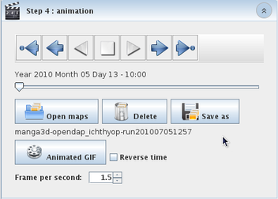

Animation
####################################

Here you will find the usual "File menu" functions : create a new configuration file, open an existing one, close it or save and save as the configuration file.

    Step 4, Animation

You may want to skip that step or keep it for later. In that case, just go to any other steps or exit the application. Any time, you can go back to this step, click on "Open maps" and select the simulation output folder that contains the PNG pictures you wish to visualize. When the folder is opened, the application brings you back to the exact point where it was when the map creation just completed.

Set the number of frames per second of the animation with the spinner.

You can also create an animated GIF. The file is recorded in the same directory than the Ichthyop output file, with the same name and the ".gif" extension.
