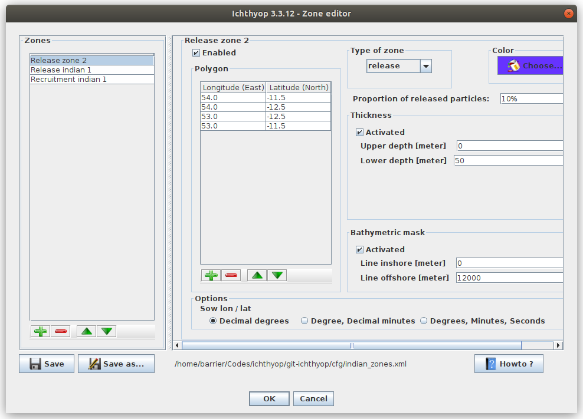

Zone definition
##################

In Ichthyop, the user can define zones, either release zones or recruitment zones. 

The zones can be edited using the GUI, as shown in :numref:`figure-gui-zone`

.. _figure-gui-zone: 

    
    Ichthyop Zone editor
